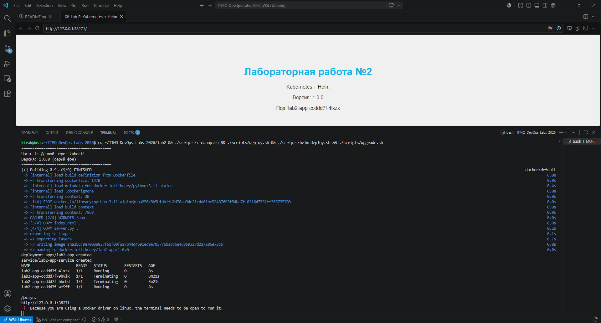
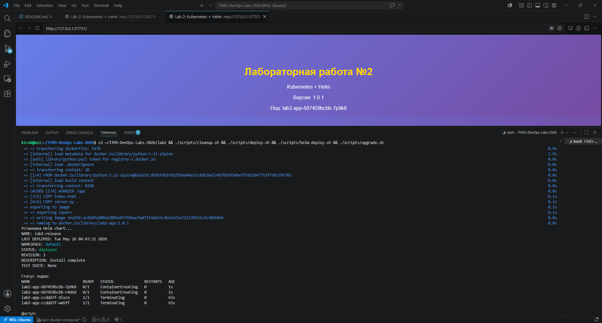
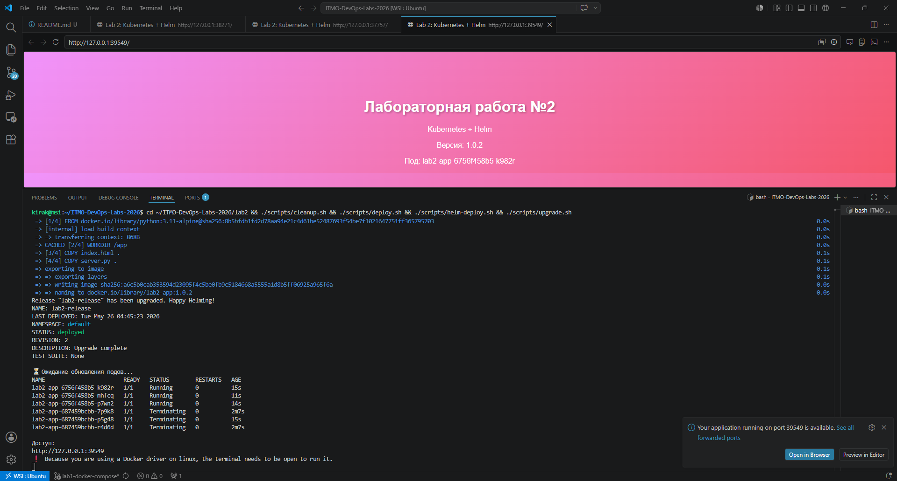

# Лабораторная работа №2: Kubernetes + Helm

## Цель работы
Поднять локальный Kubernetes кластер (minikube), развернуть сервис с использованием ресурсов Kubernetes, создать Helm chart, выполнить деплой и апгрейд релиза.

---
Приложение представляет собой простой веб-сервер на Python, который отображает HTML страницу и возвращает имя пода по запросу /hostname.

## Структура проекта
``` marcdown
lab2/
├── app/
│   ├── Dockerfile
│   ├── index.html          # один файл, меняется через sed
│   └── server.py
├── kubernetes/
│   ├── deployment.yaml
│   └── service.yaml
├── helm-chart/
│   ├── Chart.yaml
│   ├── values.yaml
│   └── templates/
│       ├── deployment.yaml
│       └── service.yaml
├── screenshots/
│   ├── image.png
│   │   ...
│   └── image-n.png
├── scripts/
│   ├── deploy.sh           # kubectl деплой (фон серый)
│   ├── helm-deploy.sh      # Helm деплой (фон синий)
│   └── upgrade.sh          # Helm апгрейд (фон розовый)
└── README.md
```

## Сравнение версий

| Версия | Команда деплоя | Фон | Реплики |
|--------|----------------|-----|---------|
| 1.0.0 | `./scripts/deploy.sh` | Серый | 2 |
| 1.0.1 | `./scripts/helm-deploy.sh` | Синий градиент | 2 |
| 1.0.2 | `./scripts/upgrade.sh` | Розовый градиент | 3 |

---

## Почему Helm удобнее классического деплоя?

| № | Причина | Объяснение |
|---|---------|------------|
| 1 | **Шаблонизация** | Все параметры (реплики, образы, порты) вынесены в `values.yaml`. Не нужно дублировать манифесты для разных окружений (dev/stage/prod) |
| 2 | **Управление версиями** | `helm history` показывает все версии релиза. `helm rollback` откатывает к любой версии одной командой |
| 3 | **Одна команда деплоя** | Вместо `kubectl apply -f deployment.yaml && kubectl apply -f service.yaml` достаточно `helm install` |

---

## Часть 1: Развертывание через Kubernetes манифесты

### 1.1 Подготовка окружения

Перед началом работы необходимо запустить локальный Kubernetes кластер:

```bash
# Запуск minikube с драйвером docker
minikube start --driver=docker

# Проверка статуса кластера
minikube status

# Проверка узлов
kubectl get nodes
```

### Результат:




## Часть 2: Развертывание и обновление через Helm 

### Результат:

Разевертывание через Helm 


Обновление и добавление пода через Helm 


## Полный список команд для запуска

```bash
cd ~/ITMO-DevOps-Labs-2026/lab2

# 1. Очистка всех ресурсов
./scripts/cleanup.sh

# 2. Деплой через kubectl (версия 1.0.0, серый фон)
./scripts/deploy.sh

# 3. Деплой через Helm (версия 1.0.1, синий фон)
./scripts/helm-deploy.sh

# 4. Апгрейд Helm (версия 1.0.2, розовый фон, 3 реплики)
./scripts/upgrade.sh

# Или
cd ~/ITMO-DevOps-Labs-2026/lab2 && ./scripts/cleanup.sh && ./scripts/deploy.sh && ./scripts/helm-deploy.sh && ./scripts/upgrade.sh
```