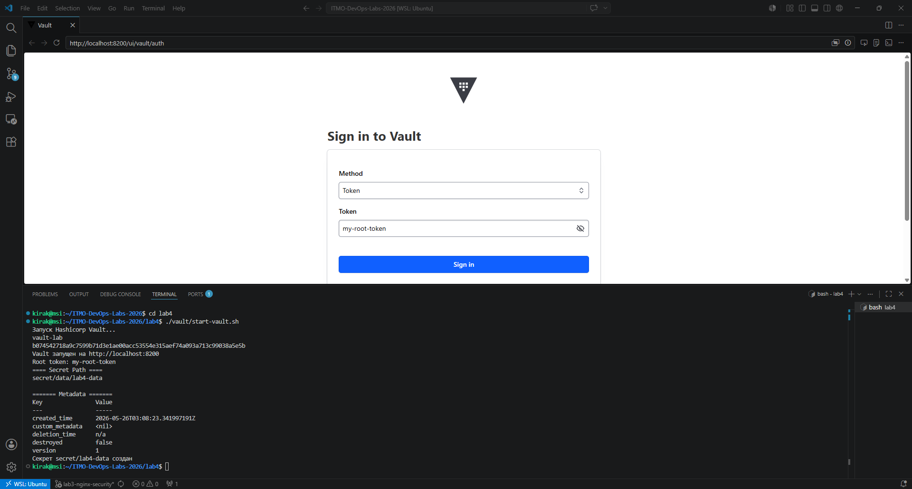
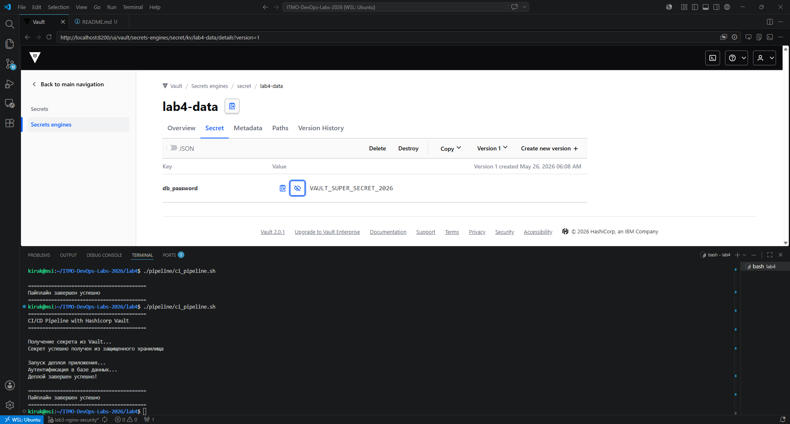
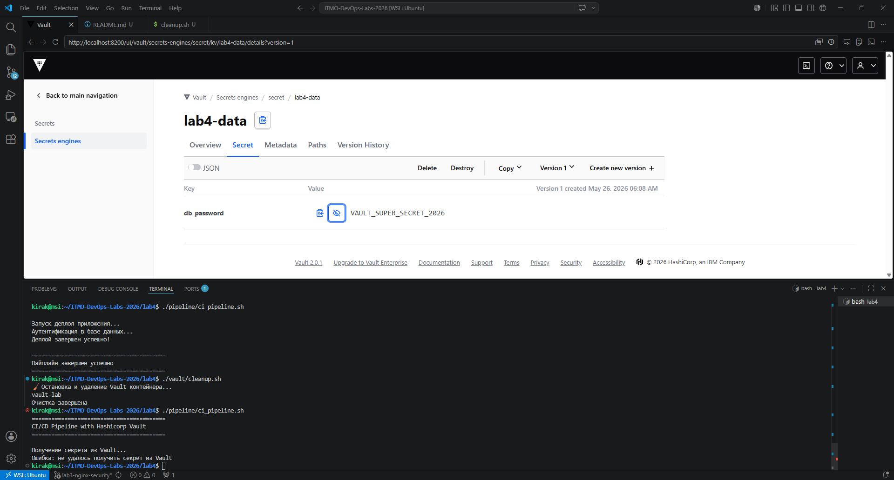

# Лабораторная работа №4: CI/CD + Hashicorp Vault

## Цель работы
Написать "плохой" и "хороший" CI/CD файлы (GitLab CI), настроить Hashicorp Vault для безопасного хранения секретов, интегрировать его с CI/CD пайплайном.

---
```
## Структура проекта
lab4/
├── .gitlab-ci-bad.yml # Плохой CI/CD (5+ антипаттернов)
├── .gitlab-ci.yml # Хороший CI/CD (исправления)
├── vault/
│ ├── start-vault.sh # Запуск Vault в Docker
│ └── cleanup.sh # Остановка Vault
├── pipeline/
│ └── ci_pipeline.sh # Скрипт с получением секрета из Vault
├── screenshots/ # Скриншоты для отчёта
│ ├── vault-start.png # --- СКРИН 1: Запуск Vault
│ ├── vault-secret.png # --- СКРИН 2: Секрет в Vault UI
│ ├── pipeline-run.png # --- СКРИН 3: Запуск CI/CD скрипта
│ ├── pipeline-success.png # --- СКРИН 4: Успешное выполнение (пароль скрыт)
│ └── vault-cleanup.png # --- СКРИН 5: Остановка Vault
└── README.md
```
## Часть 1: CI/CD файлы

### 1.3 Таблица плохих практик и исправлений

| № | Плохая практика | Почему плохо | Исправление | Влияние |
|:--|:----------------|:-------------|:------------|:--------|
| 1 | `image: python:latest` | Нефиксированная версия → невоспроизводимость | `image: python:3.11-slim` | Стабильность |
| 2 | `pylint myscript.py \|\| true` | Ошибки линтера игнорируются | `pylint myscript.py` | Качество кода |
| 3 | Нет `cache:` | Медленные сборки | `cache: paths: - .cache/pip` | Скорость ↑ |
| 4 | `docker login -u "admin" -p "p@ssword123"` | Пароль в коде | `echo "$DOCKER_REGISTRY_PASSWORD" \| docker login -u "$DOCKER_USER" --password-stdin` | Безопасность |
| 5 | Деплой без условий | Любая ветка уходит на прод | `rules: - if: $CI_COMMIT_BRANCH == "main"` | Надёжность |

## Часть 2: Hashicorp Vault


### 2.1 Запуск Hashicorp Vault
Для безопасного хранения секретов был поднят Hashicorp Vault в Docker контейнере:

```bash

docker run -d --name vault-lab \
  --cap-add=IPC_LOCK \
  -p 8200:8200 \
  -e 'VAULT_DEV_ROOT_TOKEN_ID=my-root-token' \
  hashicorp/vault server -dev -dev-listen-address="0.0.0.0:8200"

  ```

Резульат Запуска Hashicorp Vault


Аутентификация в Vault UI


Секрет в Vault UI


CI/CD скрипт по получению секрета (пароль скрыт в логах)


Остановка Vault


### Итого
- Все секреты компании в одном защищённом месте — смена пароля в Vault "обновляет" его для всех пайплайнов

- Секрет не попадает в логи — переменная существует только в оперативной памяти и не выводится через echo

- Политики доступа — можно настроить: "пайплайну разрешено только читать пароль, а разработчику — только менять его"

- Маскирование — после завершения скрипта переменная исчезает без следа

### Проблемы CI/CD переменных репозитория

| № | Проблема | Риски |
|:--|:---------|:------|
| 1 | **Расползание секретов** — пароль копируется в каждый репозиторий | Смена пароля требует обновления в 10+ местах |
| 2 | **Избыточный доступ** — любой Maintainer может нажать "Reveal value" | Инсайдерская угроза, доступ к БД у кого его быть не должно |
| 3 | **Отсутствие ротации** — секреты живут годами | Чем дольше секрет, тем выше риск утечки |
| 4 | **Нет аудита** — нельзя узнать, кто использовал секрет | Невозможно расследовать утечку |
| 5 | **Попадание в логи** — `echo $SECRET` навсегда оставляет след | Злоумышленник с доступом к логам получит секрет |